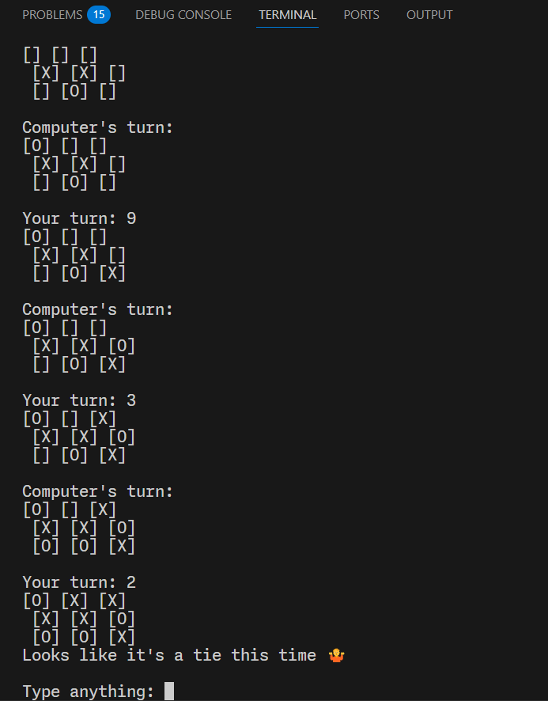

# TIC TAC TOE - COMMAND LINE GAME

A simple and interactive command line version of tic tac toe. It can be played alone (against the computer) or with a friend.
It features a game guide and accepts different commands to interact with the game. 
It can also handle errors, invalid inputs and invalid commands.

**_Made with python_**

_All code was written by me, no tutorial was used in the making of this_




## To run this in your machine

1. Clone this repository or download it as a zip file (you'll need Python installed):
   ```bash
   git clone https://github.com/milarr65/Tic-Tac-Toe.git
   ```
2. Open the directory in your preferred text editor or terminal.
3. Create a virtual environment and activate it:

   ```
    python -m venv .venv
    .\.venv\Scripts\activate  # On Windows
    source .venv/bin/activate  # On macOS/Linux

   ```

4. Run the app:
   ```
   python main.py
   ```

